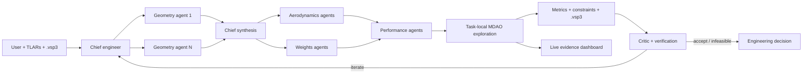

# Jango AGI

**An autonomous Chief Engineer for constrained aircraft preliminary design, running natively inside Introspection tasks.**

Give Jango an OpenVSP `.vsp3`, a TLAR set, and a difficult change such as “increase range to 8,000 km while preserving payload, field length, MTOW, climb, and stability.” The Chief formalizes the contract, creates the engineering team it needs, runs coupled numerical exploration, reviews failures, iterates, and closes with a traceable accepted or infeasible decision.

There is no computer vision, GUI automation, MCP tunnel, local solver binding, Docker daemon, or external Jango server in the hosted execution path.

## What is implemented

- Dynamic Chief delegation to multiple geometry, aerodynamics, weights, performance, verification, and critic agents.
- Parallel hypotheses and sequential hand-offs controlled by the Chief.
- A deterministic seeded conceptual MDAO engine executed inside the task.
- Generic objective modes (`target`, `maximize`, `minimize`) and arbitrary cross-metric constraints.
- TLAR support for payload/people, range, take-off distance, climb rate, cruise/max speed, MTOW, landing distance, max/operating altitude, operating attitude, L/D, static margin, stall speed, and fuel.
- OpenVSP validation, immutable SHA-256 provenance, bounded main-wing/tail mutation, candidate `.vsp3`, and sidecar manifest.
- Evidence per run: study contract, JSONL events, full result, engineering report, modified geometry, deterministic replay, and an animated live dashboard.
- An Introspection validation tool that exercises every TLAR pathway end to end.

## Runtime architecture



The specialist agents reason about discipline strategy and challenge assumptions. The deterministic engine is authoritative for numerical candidates and gates. The Chief can start multiple instances of the same role and explicitly pass the selected geometry into later aerodynamic/performance rounds.

## Run and verify locally

```bash
cd sdk/introspection/recipe
npm test
npm run smoke

npx @introspection-ai/pi-recipes check . --profile publish
cd ../../..
npx @introspection-ai/cli recipes validate \
  --work-dir . --path .introspection/jango.yaml --profile publish
```

Run one study directly without an LLM:

```bash
node sdk/introspection/recipe/solver/cli.mjs run \
  --geometry sdk/models/boeing777200.vsp3 \
  --study path/to/study.json \
  --output /tmp/jango-study
```

Example contract:

```json
{
  "objective": { "metric": "range_km", "mode": "target", "target": 8000 },
  "constraints": [
    { "metric": "payload_kg", "operator": ">=", "value": 18000 },
    { "metric": "mtow_kg", "operator": "<=", "value": 90000 },
    { "metric": "takeoff_distance_m", "operator": "<=", "value": 1800 },
    { "metric": "static_margin", "operator": ">=", "value": 0.05 }
  ],
  "budget": 1200,
  "seed": 42
}
```

## Engineering fidelity

This is real deterministic computation and geometry mutation, but the bundled model is conceptual/preliminary fidelity. It does **not** pretend to be VSPAERO, CFD, FEA, flight test, or certification evidence. Every report says so and identifies higher-fidelity verification as the next gate. Introspection can run this implementation with no external binding; a future headless solver package can replace or augment the model behind the same tool contract.

## Repository map

- `sdk/introspection/recipe/` — active Chief organization, local tools, solver, dashboard, skills, judges, tests, and reference geometry.
- `.introspection/jango.yaml` — hosted runtime manifest.
- `sdk/models/` — source OpenVSP geometry and reference outputs.
- `sdk/chief_engineer/` and `sdk/docker/` — previous external-worker implementation, retained as historical/local comparison and not used by the hosted recipe.
- `cu/`, `bot/`, and GUI-related folders — legacy prototype history, outside the Jango runtime.
