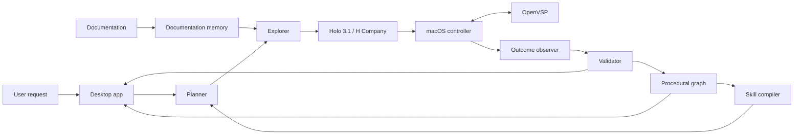

# Otto / Hacknation

> **Hacknation architecture:** the system is moving from GUI computer vision
> to direct engineering-software APIs. The chief engineer decomposes a goal,
> builds sequential/parallel specialist teams, provisions API workers, transfers
> selected design artifacts between domains, and iterates through chief reviews.
> See [sdk/HACKNATION.md](sdk/HACKNATION.md).

**Teach once. Operate forever.**

Otto is evolving into an engineering chief-engineer agent that coordinates
specialized workers through software APIs. The original desktop computer-use
prototype remains in the repository as a reference implementation.

Instead of being programmed for a particular interface, Otto reads the software documentation, safely explores the UI using H Company's computer-use models, observes the results of its actions, and builds a persistent procedural memory. It can then compose what it has learned to complete new workflows and adapt existing work when requirements change.

The goal is to help engineering teams move up to **10× faster with the same resources**—running more simulations, shortening iteration cycles, accelerating time to market, and ultimately delivering more projects.

> [!NOTE]
> Otto is currently an early-stage prototype. The MVP focuses on a controlled aircraft-design workflow in OpenVSP.

## Why Otto?

Critical workflows in aerospace, engineering, energy, healthcare, and industrial operations often depend on powerful desktop applications that have limited APIs, scarce integrations, and steep learning curves.

Engineers spend a significant part of each project operating complex tools, repeating known procedures, configuring simulations, and translating design changes into software actions. This limits the number of iterations a team can run and the number of projects it can deliver.

Otto turns that operational work into reusable knowledge. With the same engineering resources, teams can:

- Execute repetitive software workflows up to 10× faster
- Run more simulations and explore more design alternatives
- Shorten feedback and iteration cycles
- Move products from design to market faster
- Increase the number of projects completed in parallel
- Keep engineers focused on judgment, design, and decision-making

Traditional automation is brittle: it relies on hard-coded coordinates, fixed scripts, or application-specific connectors. Otto takes a different approach. It learns reusable procedures from documentation and verified interaction, then stores them as operational memory that compounds over time.

“Learning” means building persistent, inspectable procedural memory—not updating model weights in real time.

## Demo Application

The first target is [OpenVSP](https://openvsp.org/), a free, NASA-originated parametric aircraft design tool available on Apple Silicon and Intel Macs.

During the learning phase, Otto discovers how to:

- Create and select aircraft components
- Add fuselages, wings, and tails
- Modify dimensions, positions, rotations, and symmetries
- Navigate the 3D viewport
- Save and validate an aircraft model

Every successful interaction becomes a reusable, parameterized skill with:

- Preconditions
- Action steps and parameters
- Expected outcomes
- Confidence score
- Validation criteria
- Recovery strategy

## Demo Scenario

1. Otto starts with OpenVSP and no application-specific procedural memory.
2. It reads the documentation and safely explores the interface.
3. A live skill graph grows as actions are discovered and verified.
4. OpenVSP is reset to a blank project.
5. The user requests a drone with specific dimensions and components.
6. Otto combines its learned skills to build the 3D model.
7. The user adds a constraint, such as a larger wingspan or a different wing position.
8. Otto updates the existing model and validates the result.

## Desktop Experience

The desktop app is the control center for both learning and execution. It is designed to show the agent's work rather than hide it behind a chat interface.

The MVP experience includes:

- A task composer for natural-language requests and constraints
- A live view of OpenVSP and the agent's current action
- A growing skill graph with confidence and verification state
- An activity timeline containing observations, decisions, and outcomes
- Controls to pause, approve, retry, or stop execution
- A validation panel for visual, numerical, and structural checks
- Persistent procedural memory across sessions

## Architecture

### Core Components

| Component | Responsibility |
| --- | --- |
| **Holo 3.1 / H Company** | UI perception, reasoning, and action selection |
| **macOS controller** | Screenshots, mouse actions, and keyboard input |
| **Documentation memory** | Extraction and retrieval of relevant procedures |
| **Explorer** | Safe testing of reversible actions |
| **Procedural graph** | Storage of states, actions, preconditions, and outcomes |
| **Skill compiler** | Conversion of successful trajectories into reusable skills |
| **Planner** | Composition of skills into new workflows |
| **Validator** | Visual, numerical, and structural verification |
| **Desktop app** | Live visualization, supervision, and execution controls |

## Safety by Design

Otto treats computer use as a supervised, stateful process. The MVP is designed around a few core principles:

- Prefer reversible exploration and known-safe actions
- Verify outcomes instead of assuming an action succeeded
- Keep learned procedures inspectable and traceable
- Attach confidence and recovery strategies to every skill
- Ask for approval before destructive or irreversible actions
- Allow the user to pause or stop execution at any time

## MVP Scope

The MVP does not attempt to map all of OpenVSP. It learns approximately 10–15 skills required for a controlled aircraft-design workflow and expands its knowledge only when needed.

### In scope

- macOS desktop application
- OpenVSP as the first target application
- Documentation ingestion and retrieval
- Safe UI exploration through computer use
- Persistent procedural skill graph
- Skill composition for aircraft creation and modification
- Visual, numerical, and structural validation
- Human supervision and execution controls

### Out of scope for the first release

- Full coverage of OpenVSP
- Unsupervised operation of high-risk workflows
- Cross-platform desktop support
- Real-time model fine-tuning
- A general marketplace of application skills

## Success Criteria

The MVP is successful when Otto can:

1. Start with no OpenVSP-specific procedural memory.
2. Discover and persist the skills required for the demo workflow.
3. Reuse those skills after OpenVSP is reset.
4. Build a requested aircraft model from user-provided constraints.
5. Modify the model in response to a new constraint.
6. Validate the final model and expose evidence of completion.

## Project Status

Otto is under active development. The application architecture, implementation stack, development setup, and contribution guidelines will be documented as the repository takes shape.

## Long-Term Vision

The same architecture can extend beyond aerospace to legacy and specialized software across engineering, energy, healthcare, and industrial operations.

The goal is simple: transform successful interaction into durable operational knowledge that can be inspected, improved, and reused.

---

**Otto — Teach once. Operate forever.**
