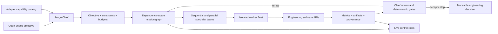

# Jango

**An API-first autonomous Chief Engineer for multidisciplinary engineering work.**

Jango accepts a difficult objective such as “minimize mass under these thermal
and stability constraints,” discovers the capabilities exposed by connected
engineering software, builds a dependency-aware execution plan, provisions
isolated workers, delegates parallel and sequential studies, and iterates from
solver evidence until it reaches an acceptance or stop condition.

Jango does not use screenshots, mouse automation, or computer vision in its
active execution path. Engineering work is performed through typed software
APIs and auditable mission events.

## What Jango does

- Converts a natural-language request into a measurable objective and constraints.
- Discovers domains, metrics, parameters, analyses, limits, and dependencies from adapter manifests.
- Creates multiple specialists per domain and batches them against an explicit worker budget.
- Supports sequential handoffs such as geometry → aerodynamics → stability.
- Supports parallel exploration by many isolated Docker workers.
- Preserves the incumbent when challengers are infeasible or worse.
- Streams plans, agents, workers, artifacts, metrics, failures, and Chief decisions to a live control room.
- Exposes the same durable mission state through HTTP and MCP for hosted agents.
- Produces evidence-linked improvement proposals without mutating or auto-promoting production.

The orchestration kernel is domain-neutral. Aerospace is the first real adapter,
not a hardcoded limit: a new adapter can introduce different domains and their
dependency graph without changing the Chief.

## Architecture



## Real execution versus development mode

Jango has two execution backends:

- `DockerVmProvider` provisions disposable solver containers and is the real
  isolated-worker path currently used with OpenVSP/VSPAERO.
- `LocalVmProvider` with `SyntheticApi` is a fast development and test backend.

Docker containers provide real process and filesystem isolation, but they are
not cloud VMs. The `VmProvider` contract is intentionally replaceable by a
Kubernetes, EC2, or other cloud provider without changing mission logic.

## Run Jango

Requirements: Python virtual environment with the project dependencies, Docker
for isolated workers, and an OpenVSP worker image for real aerospace studies.

```bash
cd sdk

MODEL_PATH="$PWD/models/boeing777200.vsp3" \
CHIEF_WORKER_PROVIDER=docker \
CHIEF_WORKER_IMAGE=hacknation-openvsp-api-worker:3.51 \
CHIEF_ENGINEER_WORKDIR="$PWD/chief-engineer-runs" \
../.venv/bin/python -m chief_engineer.server
```

Open [http://127.0.0.1:8765](http://127.0.0.1:8765), or start a mission directly:

```bash
curl -s -X POST http://127.0.0.1:8765/api/missions \
  -H 'Content-Type: application/json' \
  -d '{"goal":"Optimize L/D while staying stable","workers":12,"cycles":3}'
```

To let a reasoning model author and review mission plans, configure any
OpenAI-compatible text API:

```bash
export CHIEF_REASONING_BASE_URL=https://your-model-host/v1
export CHIEF_REASONING_API_KEY=your-key
export CHIEF_REASONING_MODEL=your-reasoning-model
```

Without those variables, Jango uses its deterministic capability-driven
planner. It still launches real configured solvers; only plan authorship changes.

## MCP and Introspection

The authenticated Streamable-HTTP MCP boundary exposes capability discovery,
mission launch, monitoring, results, event history, and bounded improvement
proposals. The Introspection recipe adds a Chief, parallel specialists, an
independent critic, a read-only maintainer, and trajectory judges.

```bash
python -m sdk.chief_engineer.mcp_server

npx @introspection-ai/cli recipes validate --path .introspection/jango.yaml
npx @introspection-ai/pi-recipes check sdk/introspection/recipe --profile publish
```

Never commit MCP tokens, model keys, or Introspection credentials. They belong
in environment variables or the deployment platform’s encrypted credential store.

## Verification

```bash
.venv/bin/python -m unittest sdk.tests.test_chief_engineer
```

The test suite covers capability-driven planning, custom non-aerospace domains,
dependency ordering, fan-out and batching, worker cleanup, durable events,
failure handling, and controlled improvement proposals.

## Repository map

- `sdk/chief_engineer/` — mission kernel, planner, adapters, fleet, APIs, MCP, and live UI.
- `sdk/docker/` — real API-worker container image.
- `sdk/introspection/recipe/` — hosted multi-agent organization and judges.
- `.introspection/jango.yaml` — Introspection runtime manifest.
- `sdk/JANGO.md` — detailed execution architecture and operating notes.
- `sdk/tests/` — unit and MCP smoke tests.

Legacy GUI/computer-vision experiments remain in historical folders for
reference, but they are not imported by Jango’s active API-only runtime.
