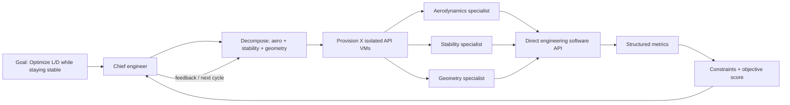

# Jango: API-first Chief Engineer

Jango's Chief does not
look at pixels and does not click OpenVSP. It receives an engineering objective,
creates a dependency graph of specialist teams, provisions isolated API
workers, transfers selected design artifacts between domains, and feeds the
evidence back into another multidisciplinary cycle.

## The loop



The core implementation lives in `chief_engineer/`:

- `reasoning.py` lets either an inspectable chief or an OpenAI-compatible text
  reasoning API design the mission graph and review each cycle.
- `planner.py` parses objectives and hard constraints into typed goal data.
- `agents.py` contains replaceable domain specialists that propose design
  changes.
- `fleet.py` provisions one isolated worker handle per concurrent candidate and
  runs them concurrently. `LocalVmProvider` is used for development and
  `DockerVmProvider` provisions real containers for API workers.
- `mission.py` executes sequential and parallel stages: selected geometry
  artifacts can fan out into many aerodynamic agents, then stability and
  structures, with chief feedback returning to the next cycle.
- `adapters.py` publishes software capability manifests and routes analyses to
  direct Python, HTTP, RPC, or containerized solver adapters.
- `api.py` defines the direct `SimulationApi` contract and the production
  OpenVSP adapter using `openvsp.SetParmVal()` and `openvsp.ExecAnalysis()`.
  Each design runs in its own crash-contained OS process.
- `server.py` exposes asynchronous missions and server-sent events.
- `control_room.html` is the live mission-control UI for teams, dependencies,
  solver state, transfers, metrics, chief decisions, and the real OBJ geometry
  produced for every studied design.

No module in this path imports the old desktop, screenshot, Holo, or GUI
trajectory layers. The old implementation remains available for comparison,
but it is no longer the execution path for Jango.

## Run the real OpenVSP product

```bash
cd sdk
MODEL_PATH="$PWD/models/boeing777200.vsp3" \
VSPAERO_PATH="$PWD/vendor/openvsp" \
CHIEF_ENGINEER_WORKDIR="$PWD/chief-engineer-runs" \
../.venv/bin/python -m chief_engineer.server
```

Launch a mission through the API:

```bash
curl -s -X POST http://127.0.0.1:8765/api/missions \
  -H 'Content-Type: application/json' \
  -d '{"goal":"Optimize L/D while staying stable", "workers":12, "cycles":3}'
```

Open `http://127.0.0.1:8765` to see the organization execute in real time.
Mission events are streamed from `/api/missions/<id>/events`; adapter manifests
are available from `/api/capabilities`. Completed missions can be replayed at
`/?mission=<id>`, including every solver-backed geometry viewer and handoff.

For model-authored mission plans and chief reviews, configure any
OpenAI-compatible text endpoint (no vision model is used):

```bash
export CHIEF_REASONING_BASE_URL=https://your-model-host/v1
export CHIEF_REASONING_API_KEY=...
export CHIEF_REASONING_MODEL=your-reasoning-model
```

For a command-line real-solver run:

```bash
../.venv/bin/python -m chief_engineer.demo "Optimize L/D while staying stable" \
  --model models/boeing777200.vsp3 \
  --vspaero vendor/openvsp --workers 6
```

`LocalVmProvider` is the local development provider. Production deployments
can use `DockerVmProvider` or replace it with a Kubernetes/cloud VM provider
while keeping the same `VmProvider` contract. A container worker runs
`chief_engineer.worker_server` and is reached through `HttpSimulationApi`.

## Runtime boundary

The Jango entry points import nothing from `cu/`, `bot/`,
`container_worker/`, or the former Holo integration. Those folders remain only
as legacy prototype history for now; they are outside the API-only runtime and
can be removed in a dedicated cleanup commit once the branch is migrated.
